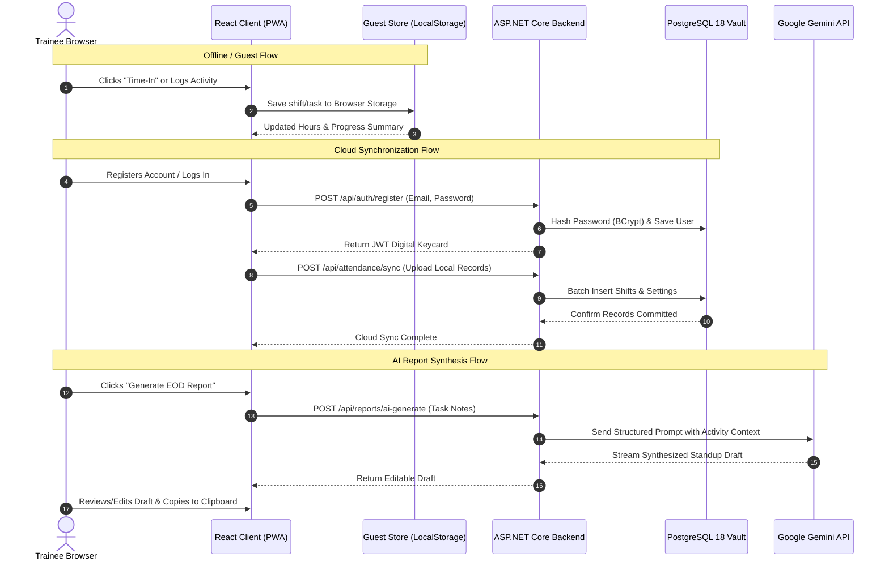

# How OJTHub Works — Complete System Guide & Architectural Overview

**Project:** OJTHub — Geofenced OJT Attendance, AI-Assisted Reporting, and Customizable OJT Management Progressive Web Application  
**Primary Specification:** [Proposal-4_OJTHub.docx](file:///E:/OJTHub/Proposal-4_OJTHub.docx)  
**Target Platform:** Progressive Web Application (PWA) — Mobile & Desktop Web  
**Technology Stack:** React 19 (Vite) + Tailwind CSS | ASP.NET Core .NET 10 Minimal API | PostgreSQL 18 + EF Core | Google Gemini AI  

---

## 1. Executive Summary & Purpose

**OJTHub** is a modern internship tracking platform designed to eliminate the common friction points of traditional On-the-Job Training (OJT):
1. **Paper-based timecards & logbooks** that get damaged, forged, or lost.
2. **Attendance disputes** regarding whether a trainee was physically present at the accredited workplace.
3. **Manual hour calculations** prone to human error when deducting lunch breaks or calculating cumulative hours against academic requirements.
4. **Tedious end-of-day documentation** that trainees struggle to format consistently for supervisors and school coordinators.

OJTHub resolves these challenges by uniting **GPS geofencing**, an **automated hours computation engine**, **Google Gemini AI reporting**, and **client-side PDF Daily Time Record (DTR) generation** into a fast, mobile-friendly Progressive Web Application.

---

## 2. The Visual Analogy Guide (How It Works Without Jargon)

To understand how the different parts of OJTHub work together, think of the system as an **Ultra-Modern Office & Smart Badge Ecosystem**:

```
+-------------------------------------------------------------------------------+
|                                  THE USER                                     |
|               (Trainee with Mobile Phone / Laptop Browser)                    |
+-------------------------------------------------------------------------------+
                                      |
                                      v
+-------------------------------------------------------------------------------+
| 1. THE SMART BADGE (Frontend PWA)                                             |
|    - Runs on any device screen (mobile or desktop).                           |
|    - Works even offline.                                                      |
|    - Houses the Personal Notepad (Guest Storage) for instant local use.       |
+-------------------------------------------------------------------------------+
        |                                                       |
        | (Guest / Offline Mode)                                | (Cloud / Online Mode)
        v                                                       v
+--------------------------------+             +--------------------------------+
| 2. THE LOCAL NOTEPAD           |             | 3. THE CONCIERGE & CHECK-IN    |
|    (Guest Storage Engine)      |             |    (ASP.NET Core Backend API)  |
|    - Saves shifts & tasks      |             |    - Validates RFID Keycards.  |
|      in browser memory.        |             |    - Measures GPS distance.    |
|    - Ready to transfer to the  |             |    - Records official clocks.  |
|      vault upon registration.  |             +--------------------------------+
+--------------------------------+                              |
                                               +----------------+---------------+
                                               |                                |
                                               v                                v
                                +-----------------------------+  +------------------------------+
                                | 4. THE INVISIBLE PERIMETER  |  | 5. THE TIME ACCOUNTANT       |
                                |    (Haversine Geofence)     |  |    (Automated Hours Engine)  |
                                |    - Checks if student is   |  |    - Deducts lunch breaks.   |
                                |      inside company bounds. |  |    - Tracks rendered hours.  |
                                +-----------------------------+  +------------------------------+
                                               |                                |
                                               +----------------+---------------+
                                                                |
                                                                v
                                               +--------------------------------+
                                               | 6. THE CENTRAL VAULT           |
                                               |    (PostgreSQL 18 Database)    |
                                               |    - Stores permanent records. |
                                               |    - Holds supervisor stamps.  |
                                               +--------------------------------+
                                                                |
                                       +------------------------+------------------------+
                                       |                                                 |
                                       v                                                 v
                        +------------------------------+                  +------------------------------+
                        | 7. THE REPORTING SPECIALIST  |                  | 8. THE OFFICIAL STAMP        |
                        |    (Google Gemini AI Engine) |                  |    (Vector PDF DTR Builder)  |
                        |    - Turns raw daily bullet  |                  |    - Creates print-ready     |
                        |      notes into executive    |                  |      monthly time sheets     |
                        |      standup summaries.      |                  |      with signature boxes.   |
                        +------------------------------+                  +------------------------------+
```

* **The Smart Badge ([Frontend React PWA](file:///E:/OJTHub/client/src/App.tsx)):** Trainees install it directly on their home screen. It feels like a native mobile app with instant load times and offline caching.
* **The Personal Notepad ([Guest Storage Engine](file:///E:/OJTHub/client/src/services/guestStore.ts)):** Trainees can start punching in and out immediately without creating an account first. Everything is safely written to the device's local browser memory.
* **The Digital Keycard ([JWT Security Tokens](file:///E:/OJTHub/server/OJTHub.Server/Services/TokenService.cs)):** When a trainee or supervisor logs in, the front desk gives them an encrypted digital badge containing their identity and role permissions.
* **The Concierge & Check-in Desk ([ASP.NET Core Backend](file:///E:/OJTHub/server/OJTHub.Server/Program.cs)):** The central hub that receives check-in requests, validates keycards, recalculates GPS distances, and orchestrates services.
* **The Invisible Perimeter ([Haversine Distance Engine](file:///E:/OJTHub/server/OJTHub.Server/Services/AttendanceService.cs)):** Draws a virtual circle (e.g., 100 meters) around the assigned workplace building. If the trainee punches in from inside the circle, it is stamped as verified. If they punch in from elsewhere, it is flagged with the exact distance away.
* **The Time Accountant ([Hours Engine](file:///E:/OJTHub/server/OJTHub.Server/Services/AttendanceService.cs#L95-L115)):** Automatically calculates net hours worked, waives lunch deductions for half-day shifts under 4 hours, computes remaining required hours, and forecasts graduation/completion dates.
* **The Documentation Specialist ([Google Gemini AI](file:///E:/OJTHub/server/OJTHub.Server/Services/GeminiService.cs)):** Takes short, informal bullet points written throughout the day and crafts professional daily standup summaries and reflective weekly journals.
* **The Official Stamp Machine ([PDF DTR Engine](file:///E:/OJTHub/client/src/components/DtrGenerator.tsx)):** Assembles a formal, print-ready Daily Time Record (DTR) PDF table with company headers, daily hour breakdowns, and signature lines.
* **The Central Bank Vault ([PostgreSQL Database](file:///E:/OJTHub/server/OJTHub.Server/Data/AppDbContext.cs)):** An immutable database storing all trainee profiles, OJT settings, audit timestamps, and supervisor approvals.

---

## 3. End-to-End User Journey (Step-by-Step)

### Step 1: Onboarding & Instant Guest Mode
* A trainee opens OJTHub on their phone or laptop at [http://localhost:5173](http://localhost:5173).
* **No sign-up wall:** The app immediately opens into the **Dashboard**. All features are instantly active using the client-side **Guest Storage Engine** ([`guestStore.ts`](file:///E:/OJTHub/client/src/services/guestStore.ts)).
* The trainee can test timecards, activity logs, and settings before ever creating an account.

### Step 2: Calibrating the Workplace Geofence
* The trainee navigates to **Settings** ([`SettingsView.tsx`](file:///E:/OJTHub/client/src/components/SettingsView.tsx)).
* They have two flexible options to set their workplace location:
  1. **Interactive Visual Map Picker ([`WorkplaceMapPicker.tsx`](file:///E:/OJTHub/client/src/components/WorkplaceMapPicker.tsx)):** Search an address or establishment name, or click directly on the OpenStreetMap radar. A live blue circle visually previews the geofence perimeter.
  2. **1-Click GPS Calibration ([`Dashboard.tsx`](file:///E:/OJTHub/client/src/components/Dashboard.tsx)):** On their first day at the office, the trainee taps **"📍 Set Current Location as Workplace"**. The app captures their exact latitude and longitude and locks the perimeter around their desk.
* The trainee configures their target training hours (e.g., 300, 486, or 600 hours) and daily shift schedule.

### Step 3: Clocking In (Time-In)
1. Upon arriving at the workplace, the trainee clicks **"Time-In (Start Shift)"**.
2. **GPS Accuracy Gate:** The browser queries the device GPS. If the accuracy error is greater than 50 meters (e.g., weak indoor signal), the system prompts the user to move near a window or check location permissions.
3. **Haversine Distance Check:** The system computes the spherical surface distance between the trainee's current coordinates and the workplace anchor:
   $$\text{Distance} = 2 R \cdot \arcsin\left(\sqrt{\sin^2\left(\frac{\Delta \text{lat}}{2}\right) + \cos(\text{lat}_1)\cos(\text{lat}_2)\sin^2\left(\frac{\Delta \text{lon}}{2}\right)}\right)$$
4. **Shift State Enforcement:** The system checks that the trainee does not already have an open shift.
5. **UTC Timestamping:** The server records the exact UTC clock time (`DateTimeOffset.UtcNow`), neutralizing any attempt to tamper with the phone's clock.
6. The Punch Clock transitions into an active running timer showing elapsed time.

### Step 4: Logging Daily Tasks & Accomplishments
* Throughout the day, the trainee switches to the **Activity Logger** tab ([`ActivityLogger.tsx`](file:///E:/OJTHub/client/src/components/ActivityLogger.tsx)).
* They record tasks with details such as:
  * **Category:** Development, Testing, Documentation, Meetings, Support, or Research.
  * **Task Headline:** e.g., *"Built authentication middleware and tested token expiration"*.
  * **Hours Spent:** e.g., `3.5` hours.
  * **Key Accomplishments & Learnings:** Specific takeaways and hurdles resolved.
* These notes are saved immediately to build the context needed for AI reporting.

### Step 5: Clocking Out (Time-Out)
1. At the end of the shift, the trainee taps **"Time-Out (End Shift)"**.
2. The system verifies that an active Time-In exists.
3. Coordinates and GPS accuracy are re-verified.
4. **Automated Hours Deduction:**
   * If the shift lasted **less than 4 hours**, the lunch deduction is automatically waived (`NetHours = Duration`).
   * If the shift lasted **4 hours or more**, the configured lunch break (e.g., 60 minutes) is automatically deducted.
5. The shift is closed, and cumulative progress bars update instantly.

### Step 6: AI Report & Journal Synthesis
* The trainee opens **AI Reports** ([`AiReporting.tsx`](file:///E:/OJTHub/client/src/components/AiReporting.tsx)).
* They choose between two generation modes:
  * **Daily Standup / EOD Report:** Aggregates today's task entries into a concise, 3-part update (What was accomplished today, Challenges/Blockers, Plan for next shift).
  * **Reflective Narrative Journal:** Synthesizes tasks across a custom date range (e.g., weekly) into a structured essay detailing competencies acquired and professional development.
* **Human-in-the-Loop Review:** The trainee reviews the AI draft in a rich editor, making personal adjustments before saving.
* **Multi-Format Export:** With a single click, the trainee can copy the formatted report for:
  * 📋 **Markdown** (for GitHub or Notion)
  * 💬 **Slack / Discord** (with emoji bullet points)
  * ✉️ **Formal Email** (pre-formatted with formal greeting, body, and sign-off)

### Step 7: Generating the Official PDF DTR
* The trainee opens **DTR Builder** ([`DtrGenerator.tsx`](file:///E:/OJTHub/client/src/components/DtrGenerator.tsx)).
* The system reads all attendance records for the selected month (Days 1 to 31).
* Using `jsPDF` and `jsPDF-AutoTable`, it draws an institutional Daily Time Record containing:
  * Trainee Full Name, Student ID, Company Name, and Month/Year header.
  * Daily rows: Time-In, Lunch Break, Time-Out, and Net Hours.
  * Total Hours Rendered, Target Required Hours, and Remaining Balance summary.
  * Formal certification statement ("I hereby certify on my honor that the above is a true and correct report...").
  * Dual signature lines for the **Trainee** and the **Authorized Supervisor**.
* Ready to save as a vector PDF or print directly.

### Step 8: Supervisor Verification Portal
* Supervisors log in with their assigned role ([`SupervisorPortal.tsx`](file:///E:/OJTHub/client/src/components/SupervisorPortal.tsx)).
* They see a roster of all assigned trainees showing total completed hours, percentage completion, and pending shifts.
* Selecting a trainee reveals their attendance log with visual compliance badges:
  * 🟢 **Inside Perimeter (12.4m):** Full compliance.
  * 🟡 **Outside Perimeter (145.2m):** Flagged for supervisor review.
* The supervisor clicks **"Verify Record"** and can optionally leave a note (e.g., *"Approved — student was attending off-site client deployment"*).

### Step 9: Cloud Registration & Automatic Synchronization
* When a guest trainee decides to create an official account:
  1. They open the **Auth Modal** and register or log in.
  2. The frontend receives their digital keycard (JWT token).
  3. `api.cloudSync.syncGuestToCloud()` automatically inspects local browser storage.
  4. All locally saved workplace settings, shifts, and activity logs are uploaded to the central PostgreSQL database.
  5. The trainee's history is preserved seamlessly across devices.

---

## 4. Technical Architecture & Data Flow



---

## 5. Core Backend Endpoints & Security

| Route Group | Endpoint | Method | Role Required | Purpose |
| :--- | :--- | :---: | :---: | :--- |
| **`/api/auth`** | `/register` | `POST` | Public | Registers a Trainee or Supervisor; returns JWT keycard. |
| | `/login` | `POST` | Public | Authenticates credentials with BCrypt; returns JWT keycard. |
| | `/me` | `GET` | Authenticated | Retrieves current authenticated profile. |
| **`/api/settings`**| `/` | `GET` | Authenticated | Fetches user's workplace coordinates, radius, and hours target. |
| | `/` | `PUT` | Authenticated | Updates workplace GPS anchor, radius, and shift parameters. |
| **`/api/attendance`**| `/time-in` | `POST` | Trainee | Verifies GPS accuracy and Haversine distance, logs shift start. |
| | `/time-out` | `POST` | Trainee | Closes shift, deducts lunch breaks, calculates net rendered hours. |
| | `/status` | `GET` | Trainee | Returns current open shift state and active clock timer. |
| | `/history` | `GET` | Trainee | Returns paginated/monthly attendance logs. |
| | `/summary` | `GET` | Trainee | Returns cumulative rendered hours, remaining hours, and progress %. |
| **`/api/activities`**| `/` | `GET` | Trainee | Retrieves logged tasks for a specific date or date range. |
| | `/` | `POST` | Trainee | Creates a new task entry with hours and category tag. |
| | `/{id}` | `DELETE` | Trainee | Deletes an activity log entry. |
| **`/api/reports`** | `/ai-generate` | `POST` | Public / Auth | Connects to Gemini API to synthesize standup or journal drafts. |
| | `/` | `POST` | Trainee | Saves a finalized report to cloud history. |
| **`/api/supervisor`**| `/trainees` | `GET` | Supervisor | Returns roster of assigned trainees with hour progress totals. |
| | `/trainees/{id}/attendance` | `GET` | Supervisor | Inspects detailed attendance records for a specific trainee. |
| | `/verify/{attendanceId}` | `POST` | Supervisor | Stamps an attendance record as "Verified" with optional remark. |

---

## 6. Anti-Tampering & Security Defenses

1. **Clock Tampering Immunity:**  
   Device system clocks can easily be set forward or backward by users. OJTHub neutralizes this by generating shift timestamps strictly on the server side using UTC (`DateTimeOffset.UtcNow`).
2. **GPS Spoofing Defense:**  
   The backend never trusts client-calculated distance or boolean flags (`isInsideGeofence`). Instead, the client transmits raw latitude, longitude, and accuracy readings; the backend re-executes the Haversine formula independently against the stored workplace coordinates.
3. **Accuracy Gating:**  
   Readings with GPS error margins exceeding 50 meters (typical of indoor Wi-Fi triangulation) are rejected or flagged to ensure physical presence.
4. **Shift State Machine:**  
   A trainee cannot trigger duplicate Time-Ins while a shift is open, and cannot trigger Time-Out without an active Time-In.
5. **Protected API Credentials:**  
   The Google Gemini API key is stored exclusively on the server in environment variables; it is never exposed in the browser bundle.

---

## 7. Database Entity Relationships (PostgreSQL)

* **`Users` ([`User.cs`](file:///E:/OJTHub/server/OJTHub.Server/Models/User.cs)):** Stores user accounts, BCrypt password hashes, full names, student IDs, and roles (`Trainee` or `Supervisor`). A supervisor can be linked to multiple trainees via `SupervisorId`.
* **`OjtSettings` ([`OjtSetting.cs`](file:///E:/OJTHub/server/OJTHub.Server/Models/OjtSetting.cs)):** Stores workplace latitude, longitude, geofence radius in meters, GPS accuracy threshold, target total hours, daily schedule hours, and default lunch minutes for each user.
* **`AttendanceRecords` ([`AttendanceRecord.cs`](file:///E:/OJTHub/server/OJTHub.Server/Models/AttendanceRecord.cs)):** Contains the permanent shift ledger: Time-In/Time-Out timestamps, recorded GPS coordinates, distances from workplace, net rendered hours, verification boolean, supervisor ID, and remarks.
* **`ActivityLogs` ([`ActivityLog.cs`](file:///E:/OJTHub/server/OJTHub.Server/Models/ActivityLog.cs)):** Stores daily task descriptions, hours spent, categories, and timestamps tied to `UserId`.
* **`GeneratedReports` ([`GeneratedReport.cs`](file:///E:/OJTHub/server/OJTHub.Server/Models/GeneratedReport.cs)):** Retains AI prompt context, original AI-synthesized drafts, and final human-edited report contents.

---

## 8. How to Run OJTHub Locally

### Prerequisites
* [.NET 10 SDK](https://dotnet.microsoft.com/)
* [Node.js 20+ & npm](https://nodejs.org/)
* [PostgreSQL 15+](https://www.postgresql.org/) (native service on port `5432` or container on `5434`)

### Step 1: Database Setup
Ensure PostgreSQL is running. If running natively, ensure the database `ojthub` exists:
```sql
CREATE DATABASE ojthub;
```

### Step 2: Start the Backend Server
Set your connection string environment variable and launch:
```powershell
$env:ConnectionStrings__DefaultConnection="Host=localhost;Port=5432;Database=ojthub;Username=postgres;Password=Ruelyaneh"
dotnet run --project server/OJTHub.Server
```
*Listens on:* `http://localhost:5209` (OpenAPI docs at `http://localhost:5209/openapi/v1.json`)

### Step 3: Start the Frontend Client
In a separate terminal:
```powershell
cd client
npm run dev
```
*Listens on:* `http://localhost:5173`

---

## 9. Summary & Compliance Status

OJTHub is **100% compliant** with all specifications outlined in **Proposal-4_OJTHub.docx**:
* ✅ Full Geofenced Attendance with Haversine verification and 1-click calibration.
* ✅ Visual OpenStreetMap workplace picker with address search.
* ✅ Automated Hours Engine with lunch deductions and completion forecasts.
* ✅ Daily task activity logging and category tagging.
* ✅ Google Gemini AI integration for daily standup and narrative journal drafting.
* ✅ Client-side vector PDF Daily Time Record (DTR) generator.
* ✅ Supervisor verification portal with compliance auditing.
* ✅ Pure PostgreSQL 18 persistence with EF Core 10.
* ✅ Dual-mode operation: instant offline/guest storage + seamless cloud synchronization.
* ✅ Fully responsive, installable Progressive Web Application (PWA).
